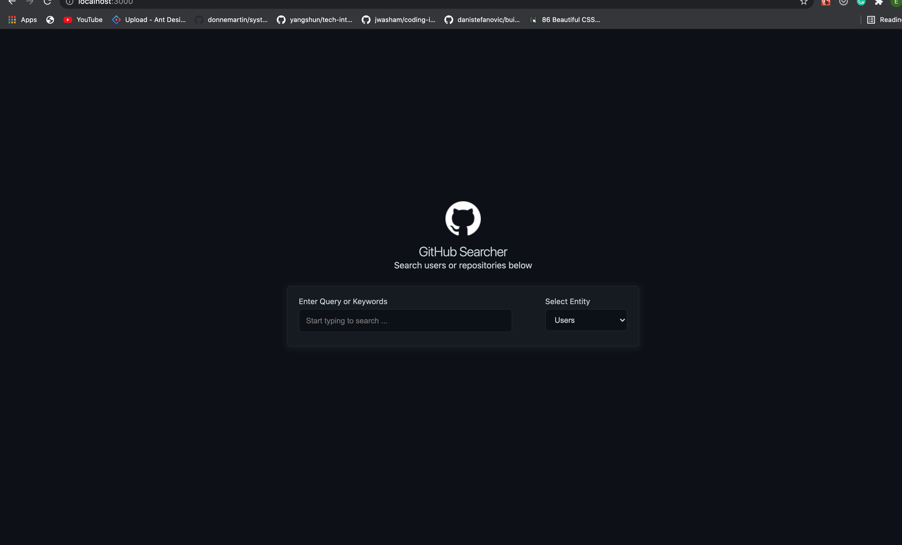
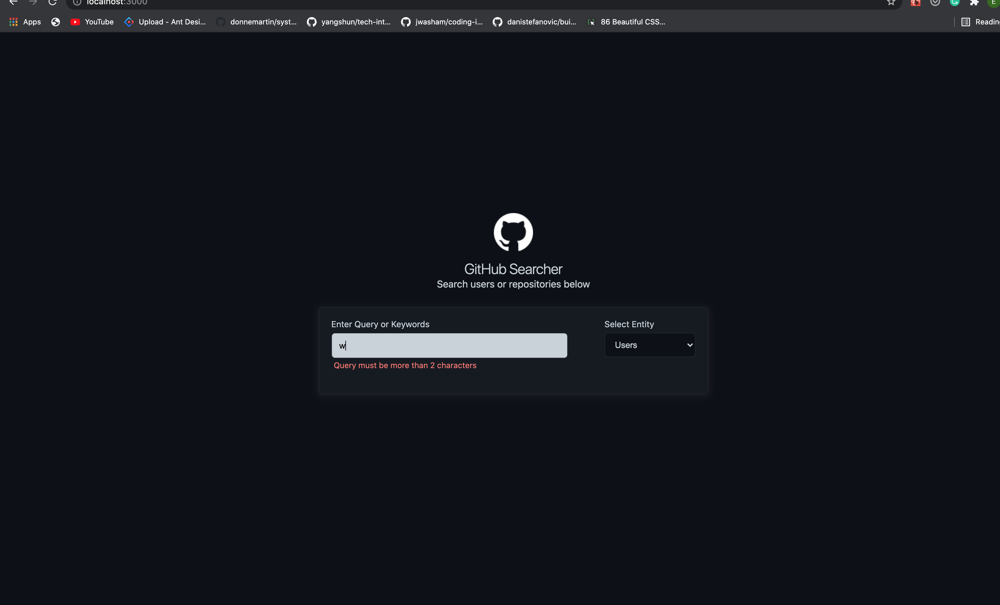
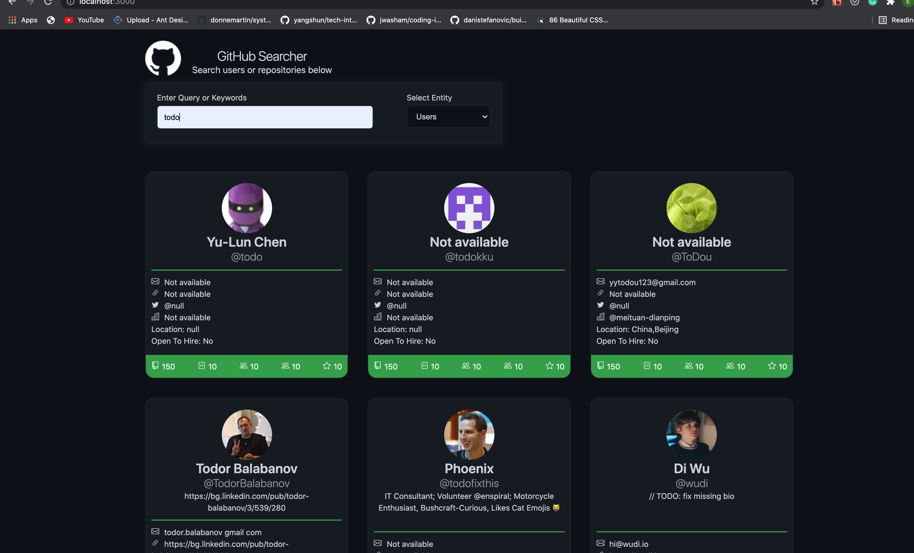
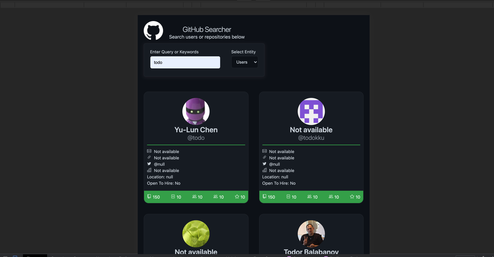

 
# Github Searcher
 
This project was bootstrapped with [Create React App](https://github.com/facebook/create-react-app). An application used to get information about a github user or a repository
 
## Project Screen Shot(s)
 
 
## Installation and Setup Instructions
 
Clone down this repository. You will need `node` and `yarn` installed globally on your machine. 
 
Visit [github]( https://github.com/) to create an oAuth token and to your env file. At the end your .env file should look like the .env.example file
 
Installation (run command in terminal):
 
`yarn` 
 
To Run Test Suite: 
 
`yarn test` 
 
To Start Server:
 
`yarn start` 
 
To Visit App:
 
`localhost:3000` 
 
## Reflection
 
   - This project aims to create a solution that interacts with the already existing github search api and provide client and users information about different users and their repositories on github. This solution focuses on the frontend and tries to create a pleasing interface that can be worked with. Real life scenarios where this solution can be used include job|talent search, searching for users with particular skill sets, open source and other project search.
 
   - I approached this application with a lean approach Focusing on smaller parts of the application before venturing into other complex logic.
 
   - The technologies used and my reason for these choices include:
 
       React which is a Component-Based Javascript framework that allows for building of user interfaces based on components that manage their own state. The flexibility of react
      
       There are a lot of network calls going on in the application. The choice to use redux and redux-persist allowed for easy state management and persistence of data into local storage to avoid repetition of query already retrieved and improving optimisation. This also allows for a certain level of app functionality when offline.
 
       I also implemented debounce to make sure I don't make api calls unnecessarily
 
       React-testing-library was used to test the application behavior and avoid testing implementation. This was picked over other testing packages because it is relatively easy to use and it comes with create-react-app so no need for extra installations.
 
       Axios for api calls
 
       React-toastify for error logging
 
       react-infinite-scroll to implement infinite scrolling
 
       Github for version control.
 
       Netlify for hosting.
 
 
 - The biggest issue I can say I had while working on this problem was state management. Trying to manage the state across all levels of the app and displaying the appropriate information to the client as necessary.
 - Things that I believe would be implemented in the nearest future include: creating a dark and light theme to cater for different user preferences, improve state management logic and cater better for all state changes, properly test the application and ensure it has max coverage, improve optimization across the system.
 
 Here are links to too some pages I have worked on:
 
 [Decagon Fellowship page](https://decagonhq.com/fellowship/)
 
 [Devconnect Austin](https://decagonhq.com/devconnectaustin/)
 
[Mentorship Campaign](https://decagonhq.com/devconnectaustinmentor/)
 
[Linkedin Profile](https://www.linkedin.com/in/eze-francisca/)
 
Link to Github Searcher: [Hosted App](https://unruffled-wiles-c754ee.netlify.app/)

## Project shots

 

#### Welcome View

 

#### Error View

 

#### Search Views

 

